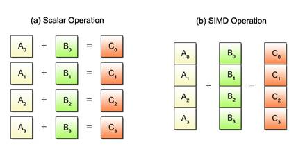

# numpy vs C++

Python 에서 사용되는 대표적인 라이브러리로 `numpy` 를 꼽을 수 있습니다. `numpy` 는 벡터화된 연산을 지원합니다. 배열/행렬 끼리의 덧셈, 곱셈 등의 연산을 아주 빠르게 수행할 수 있습니다.

`numpy` 는 C/C++ 로 구현되어 있습니다. 그래서 느린 Python 을 극복하고 빠르게 동작할 수 있죠.

그럼 C++ 로 `numpy` 처럼 행렬 연산을 직접 구현해보겠습니다.

```cpp
void matrix_multiply(const float* a, const float* b, float* c, int n) {
    for (int i = 0; i < n; ++i) {
        for (int j = 0; j < n; ++j) {
            c[i * n + j] = 0;
            for (int k = 0; k < n; ++k) {
                c[i * n + j] += a[i * n + k] * b[k * n + j];
            }
        }
    }
}
```

직관적으로 위와같은 코드를 생각해볼 수 있습니다.

이 코드는 작은 행렬에 대해서는 Python 이나 Javascript 같은 스크립트 언어들보다 훨씬 빠르게 동작합니다.

하지만 큰 행렬에 대해서는 어떨까요? 두 행렬의 크기를 *1024x1024* 로 설정하고 `numpy` 와 비교해보겠습니다.

```python
def matrix_multiply(a: np.ndarray, b: np.ndarray) -> np.ndarray
    return np.dot(a, b)
```

```bash
❯ g++ -O3 matmul.cpp -std=c++17 -o matmul
❯ ./matmul
Time taken: 1.3178 seconds

❯ python3 matmul.py
Time taken: 0.0216 seconds
```

동일한 행렬곱 연산을 수행하는데 `-O3` 최적화 레벨을 적용한 C++ 코드보다 `numpy` 의 Python 구현이 더 훨씬 더 빠릅니다. 어떻게 이게 가능할까요?

<br>

# Single Instruction Multiple Data, SIMD

> `numpy`가 빠른 이유는 C/C++ 구현체 이기 때문이 아니라, **백엔드에서 SIMD와 같은 최적화를 활용하기 때문**입니다.

정답은 SIMD 에 있습니다.

SIMD 는 Single Instruction Multiple Data 의 약자로, 하나의 명령어로 여러 개의 데이터를 동시에 처리하는 CPU 명령어 집합을 말합니다.

변수 여러개를 하나의 레지스터에 저장한 뒤, 하나의 CPU 명령어로 레지스터에 대한 연산을 수행하는 방식이죠.



즉 이 SIMD은 CPU 차원에서 지원하는 기능이며, CPU 의 종류별로 지원 여부가 갈리며 지원하는 범위, 사용하는 방법이 모두 다릅니다.

우리가 흔히 아는 x86 아키텍처에서는 SSE, AVX, AVX2, AVX512 등의 SIMD 명령어가 있으며, ARM 아키텍처에서는 NEON 이라는 SIMD 명령어가 있습니다.

```cpp
#include <arm_neon.h>

void matmul4x4_neon(const float* A, const float* B, float* C) {
    for (int i = 0; i < 4; ++i) {
        float32x4_t a_row = vld1q_f32(&A[i * 4]);
        for (int j = 0; j < 4; ++j) {
            float32x4_t b_col = {
                B[j], B[4 + j], B[8 + j], B[12 + j]
            };
            float32x4_t prod = vmulq_f32(a_row, b_col);
            float result = vaddvq_f32(prod);
            C[i * 4 + j] = result;
        }
    }
}
```

위 코드는 NEON 명령어를 사용하여 4x4 행렬곱을 수행하는 코드입니다.

A의 `i`번째 행 4개의 원소를 하나의 레지스터에 저장하고, B의 `j`번째 열 4개의 원소를 하나의 레지스터에 저장합니다.

그 뒤 두 레지스터에 대한 곱셈을 수행하고, 결과를 더합니다.

이렇게 하면 SIMD 를 사용하여 4x4 행렬곱을 수행할 수 있습니다.

하지만 아직도 `numpy` 의 구현을 따라가기는 어렵습니다. 우리가 구현한 코드는 4x4 행렬곱만 수행할 수 있습니다. SIMD 레지스터의 크기가 정해져있기 때문입니다. `numpy` 에는 지원하는 SIMD 레지스터의 크기를 고려하여 SIMD 를 사용하는 더 복잡한 로직이 구현되어 있는거죠.

이처럼 SIMD 는 사용하기에 제약조건이 많습니다.

- CPU 에 따라 지원하는 SIMD 명령어가 다르고,
- 레지스터의 크기가 정해져있고,
- 메모리가 정렬되어 있어야 하고,
- 복잡한 분기가 필요한 경우 사용하기 어렵습니다.

이런 제약조건이 있음에도 실시간 데이터 처리, 머신러닝 등의 분야에서 여전히 강력한 기능이며 더 빠르게 동작하는 코드를 작성하기 위해 계속 사용되고 있습니다.

또한 어떤 컴파일러들은 최적화를 위해 자동으로 SIMD 명령어를 사용하는 기능을 제공하기도 합니다. 이런 경우 개발자가 명시적으로 SIMD 명령어를 사용하지 않아도 최적화된 코드를 실행할 수 있습니다.

```cpp
void sum_arrays(float* dst, const float* a, const float* b, std::size_t n) {
    for (std::size_t i = 0; i < n; ++i) {
        dst[i] = a[i] + b[i];
    }
}
```

이 코드를 `-O3` 최적화 레벨을 사용하여 어셈블리 코드로 변환해보겠습니다.

```bash
❯ g++ -O3 -S -o output.s sum_arrays.cpp
❯ cat output.s
```

```asm
...
	fadd.4s	v0, v0, v4
	fadd.4s	v1, v1, v5
	fadd.4s	v2, v2, v6
	fadd.4s	v3, v3, v7
...
```

단순히 두 배열을 서로 더하는 코드를 for loop 로 구현했는데, 어셈블리 코드를 보면 ARM NEON 의 [FADD](https://developer.arm.com/documentation/100076/0100/A64-Instruction-Set-Reference/A64-SIMD-Vector-Instructions/FADD--vector-?lang=en) 명령어가 사용됨을 알 수 있습니다.

어셈블리 코드에 SIMD 명령어가 있다고 해서 SIMD 명령어가 무조건 사용되는 것은 아니고, 컴파일러는 SIMD 가 사용될 수 있는지 검사하는 코드도 추가합니다. 모든 조건이 맞으면 SIMD 명령어가 사용됩니다. -> [참고](https://chatgpt.com/share/686872a1-4404-8002-aa81-528e059672a8)

<br>

# 1% 의 소프트웨어 만이 SIMD 의 장점을 활용한다.

SIMD 가 무엇인지 간단히 알아보았으니 [@ashvardanian 의 포스팅](https://ashvardanian.com/posts/simd-popularity/) 을 리뷰해보겠습니다.

x86 에는 지난 20년동안 계속해서 새로운 SIMD 명령어를 추가되어 왔습니다.

| 년도 | 확장 | 추가된 명령어 |
|------|-----------|---------------|
| 1997 | MMX       | + 46          |
| 1999 | SSE       | + 62          |
| 2001 | SSE2      | + 70          |
| 2004 | SSE3      | + 10          |
| 2006 | SSSE3     | + 16          |
| 2006 | SSE4.1/2  | + 54          |
| 2008 | AVX       | + 89          |
| 2011 | FMA       | + 20          |
| 2013 | AVX2      | + 135         |
| 2015 | AVX-512   | + 347         |


## SIMD 가 활용되고 있긴 한걸까?

문자열 검색을 AVX2 기반으로 구현하면, 일반적인 libc나 STL 함수보다 4×에서 많게는 12×까지 빠른 처리 속도를 기록합니다. SIMD 는 빠르다는 것과 그 이유는 설명 했지만, 실제로 얼마나 많은 소프트웨어가 SIMD 를 활용하고 있을까요?

[@ashvardanian] 은 리눅스에서 사용되는 대표적인 바이너리들을 분석하여 SIMD 를 활용하고 있는 비율을 조사했습니다.

```python
def yield_instructions_from_binary(path: str) -> Generator[InstructionSpecs, None, None]:
    with open(path, mode='rb') as file:
        code = file.read()
        md = Cs(CS_ARCH_X86, CS_MODE_64)
        md.detail = True
        md.skipdata = True
        for instruction in md.disasm(code, 0):
            yield parse_instruction(instruction)
```

[Capstone](https://github.com/aquynh/capstone) 라이브러리를 사용하여 바이너리 파일에서 실행되는 명령어를 추출합니다.

```python
registers_512b = set(['zmm' + str(i) for i in range(0, 32)])
registers_256b = set(['ymm' + str(i) for i in range(0, 32)])
registers_128b = set(['xmm' + str(i) for i in range(0, 32)])
registers_64b = set(['rax', 'rbx', 'rcx', 'rdx', 'rsp', 'rbp', 'rsi', 'rdi', 'rip'] +
                    ['r' + str(i) for i in range(8, 16)])
registers_32b = set(['eax', 'ebx', 'ecx', 'edx',
                     'esp', 'ebp', 'esi', 'edi', 'eip', 'eflags'])
registers_16b = set(['ax', 'bx', 'cx', 'dx', 'sp', 'bp',
                     'si', 'di', 'cs', 'ss', 'es', 'ds', 'ip', 'flags'])
registers_8b = set(['ah', 'al', 'bh', 'bl', 'ch', 'cl', 'dh', 'dl'])
```

x86 에서 사용되는 SIMD 명령어를 레지스터 크기별로 분류합니다.

이렇게 실제 프로그램들에서 SIMD 가 사용되는 비율을 조사해보면 흥미로운 결과를 확인할 수 있습니다.


| Binary | Instructions | All SIMD | 128-bit SIMD | 256-bit SIMD | 512-bit SIMD |
|--------|-------------|----------|--------------|--------------|--------------|
| /usr/bin/dockerd | 43M | 0.478% | 0.469% | 0.009% | 0.000% |
| /usr/bin/docker | 26M | 0.582% | 0.568% | 0.014% | 0.000% |
| /usr/bin/containerd | 21M | 0.560% | 0.543% | 0.017% | 0.000% |
| /usr/local/bin/gitlab-runner | 19M | 0.851% | 0.828% | 0.022% | 0.001% |
| /usr/bin/mongod | 16M | 0.547% | 0.545% | 0.002% | 0.000% |
| /usr/bin/mongoperf | 15M | 0.544% | 0.542% | 0.002% | 0.000% |
| /usr/bin/kubectl | 15M | 1.002% | 0.978% | 0.024% | 0.000% |
| /usr/bin/helm | 14M | 1.040% | 1.015% | 0.025% | 0.000% |
| /usr/bin/ctr | 12M | 0.564% | 0.533% | 0.030% | 0.000% |
| /usr/bin/containerd-stress | 10M | 0.551% | 0.516% | 0.035% | 0.000% |
| /usr/bin/mongos | 9M | 0.602% | 0.600% | 0.002% | 0.000% |
| /usr/bin/mongo | 9M | 0.566% | 0.564% | 0.002% | 0.000% |
| /usr/bin/snap | 8M | 0.679% | 0.635% | 0.044% | 0.000% |

프로그램에서 SIMD 명령어가 사용되는 비율이 대부분 1% 미만이라는 것을 확인할 수 있습니다.

MacOS 라고 해도 이 현상은 크게 다르지 않습니다.

| Binary | Instructions | All SIMD | 128-bit SIMD | 256-bit SIMD | 512-bit SIMD |
|--------|-------------|----------|--------------|--------------|--------------|
| /usr/local/bin/mongod | 26M | 0.636% | 0.635% | 0.001% | 0.000% |
| /usr/local/bin/libHalide.dylib | 25M | 0.289% | 0.288% | 0.001% | 0.000% |
| /usr/local/bin/influxd | 23M | 0.714% | 0.694% | 0.020% | 0.000% |
| /usr/local/bin/influx | 19M | 0.662% | 0.638% | 0.023% | 0.000% |
| /usr/local/bin/hugo | 18M | 0.760% | 0.740% | 0.019% | 0.001% |
| /usr/local/bin/mongo | 17M | 0.614% | 0.613% | 0.002% | 0.000% |
| /usr/local/bin/bazel-real | 16M | 0.141% | 0.120% | 0.020% | 0.000% |
| /usr/local/bin/node | 14M | 0.779% | 0.737% | 0.042% | 0.000% |
| /usr/local/bin/lto-dump-10 | 12M | 0.037% | 0.035% | 0.000% | 0.002% |
| /usr/local/bin/gs-X11 | 8M | 1.168% | 1.167% | 0.000% | 0.001% |


> SIMD 명령어 셋은 지속적으로 업데이트 되어가고 있고 점점 레지스터의 크기는 커지고 있으나 대부분의 프로그램에서 SIMD 명령어가 거의 사용되지 않는다.

이 결과를 여러가지 방향으로 해석해볼 수 있습니다.

- 가설:
    - 컴파일러의 자동 SIMD 최적화 기능이 부족하다.
    - 개발자가 컴파일러의 자동 SIMD 최적화 기능을 사용할 수 없는 코드를 작성하고 있다.
    - SIMD 가 없어도 상용 프로그램을 만드는 것에 문제가 없다.

결과를 어떻게 받아드릴지는 개인의 몫이지만, 3가지의 가설 모두 참일 가능성이 높습니다.

SIMD 라는 기술 특성 상 적용할 수 있는 경우가 한정되어있기에 컴파일러가 이런 경우를 캐치하기 쉽지 않을 것이며, 아주 특화된 도메인이 아닌 이상 개발자가 이정도의 최적화 수준을 고려해서 코드를 작성하지도 않을 것이고, 대부분의 프로그램이 SIMD 없이도 충분히 빠르게 동작하고 있는 것도 사실입니다.

[@ashvardanian] 는 SIMD 사용을 고려하기 전에 다른 최적화 기법을 먼저 적용해보라고 조언합니다.

- 분기 줄이기 (if, switch, loop)
- 메모리 점프, 힙 할당 최소화 (space locality, dynamic allocation)
- 런타임 다형성 회피 (virtual function, dynamic dispatch)
- 함수 인라인 가능성 최대화
- 컴파일 및 링킹 설정 조정
- I/O 병목에 비동기 처리 적용
- 병렬 컴퓨팅에서 lock free data 구조 사용 (CAS, atomic operation)

<br>

# 마치며

SIMD 명령어와 간단한 용례, 그리고 실제 프로그램에서 SIMD 명령어가 사용되는 비율을 알아보았습니다.

SIMD 는 아주 강력한 기능이지만 그 사용처가 한정되어있고 최적화가 필요할 때 후순위가 되는 경우가 많다는 것도 알 수 있었습니다.

사용하기 어렵고 제약이 따르는 기능인 만큼 현업에서는 프로젝트의 목적과 크기, 팀의 규모 등 여러 요소를 고려하여 사용 여부를 결정하는게 중요합니다.


[@ashvardanian]: https://ashvardanian.com


