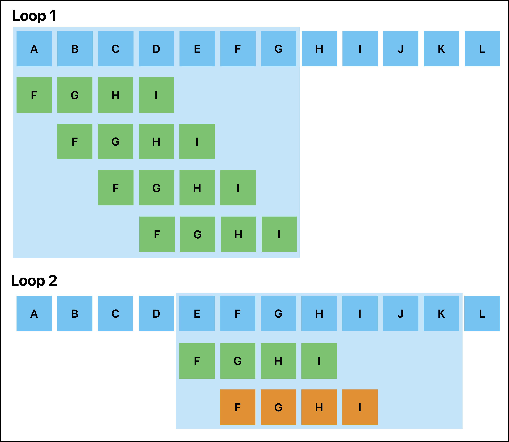

# String utilities with SIMD

지난 포스트에서는 SIMD Instruction 에 개념을 익히고 간단한 예제를 배웠습니다.

이번에는 [@ashvardanian] 의 StringZilla 프로젝트에서 사용된 문자열 관련 함수들을 살펴보고 SIMD 가 어떻게 활용되었는지 알아보겠습니다.

## Find substring

어떤 문자열이 다른 문자열에 포함되어 있는지 확인하는 함수는 문자열 처리에서 가장 기본적인 함수 중 하나입니다.

스칼라 변수에 대한 처리는 간단하게 구현할 수 있습니다.

```cpp
bool contains(const char* haystack, const char* needle) {
    size_t haystack_len = strlen(haystack);
    size_t needle_len = strlen(needle);

    for (size_t i = 0; i <= haystack_len - needle_len; i++) {
        bool match = true;
        for (size_t j = 0; j < needle_len; j++) {
            if (haystack[i + j] != needle[j]) {
                match = false;
                break;
            }
        }
        if (match) {
            return true;
        }
    }
    return false;
}
```

`contains` 함수는 나름 합리적인 구현체입니다.

하지만 SIMD 최적화의 여지는 분명히 있습니다.

[@ashvardanian] 는 `contains` 를 SIMD 로 구현하기 위해 한가지 가설을 세웠는데요, 바로 `needle` 의 첫 4글자만 먼저 검색한 후 매치되는 부분이 없으면 더 이상 검색을 진행하지 않는 것입니다.

이 가설은 문자열 탐색에서 매우 효과적인 방법이며 대부분의 경우 매우 빠르게 결과를 반환합니다.

SIMD 로 가설을 구현하면 아래와 같습니다.

```cpp
uint32_t prefix_val;
memcpy(&prefix_val, needle, 4);
uint32x4_t prefix = vdupq_n_u32(prefix_val);

uint32x4_t matches0 = vceqq_u32(vld1q_u32((uint32_t *)(haystack + 0)), prefix);
uint32x4_t matches1 = vceqq_u32(vld1q_u32((uint32_t *)(haystack + 1)), prefix);
uint32x4_t matches2 = vceqq_u32(vld1q_u32((uint32_t *)(haystack + 2)), prefix);
uint32x4_t matches3 = vceqq_u32(vld1q_u32((uint32_t *)(haystack + 3)), prefix);

uint32x4_t matches32x4 = vorrq_u32(vorrq_u32(matches0, matches1), vorrq_u32(matches2, matches3));
uint64x2_t matches64x2 = vreinterpretq_u64_u32(matches32x4);
bool has_match = vgetq_lane_u64(matches64x2, 0) | vgetq_lane_u64(matches64x2, 1);
```

이 코드는 4개의 문자열 윈도우를 한번에 비교하는 방식으로 구현되어 있습니다.



위 그림처럼 "ABCDEFGHIJKL" 에서 "FGHI" 를 찾는 경우를 생각해봅시다.

스칼라 구현에서와 컨셉은 동일하지만, 4개의 문자를 벡터 레지스터에 넣고 비교하는 방식으로 구현되어 있어 훨씬 빠릅니다.

또한 7 만큼의 범위를 루프 1회에 비교할 수 있으므로 자연스레 `loop-unrolling` 효과도 있습니다.

이렇게 4글자의 prefix 가 haystack 내부에 있는지 SIMD 로 확인 되면, 해당 위치부터 스칼라 구현처럼 문자열을 비교하면 됩니다.

아래는 벤치마크 결과입니다.

| Benchmark           | Time (ns) | CPU (ns) | Iterations |
|---------------------|-----------|----------|------------|
| BM_ContainsScalar   | 327339    | 326595   | 2124       |
| BM_ContainsSimd     | 243883    | 243700   | 2836       |


<details>
<summary><b>Benchmark Code (Click to expand)</b></summary>

```cpp
#include <arm_neon.h>
#include <cstring>
#include <cstdio>
#include <cstdint>
#include <benchmark/benchmark.h>

bool contains_scalar(
    const char* haystack,
    std::size_t haystack_len,
    const char* needle,
    std::size_t needle_len) {

    if (needle_len < 4 || haystack_len < 4) {
        return false;
    }

    for (std::size_t i = 0; i <= haystack_len - needle_len; i++) {
        bool match = true;
        for (std::size_t j = 0; j < needle_len; j++) {
            if (haystack[i + j] != needle[j]) {
                match = false;
                break;
            }
        }
        if (match) {
            return true;
        }
    }
    return false;
}

bool contains_simd(
    const char* haystack,
    std::size_t haystack_len,
    const char* needle,
    std::size_t needle_len) {

    if (needle_len < 4 || haystack_len < 4) {
        return contains_scalar(haystack, haystack_len, needle, needle_len);
    }

    uint32_t prefix_val;
    memcpy(&prefix_val, needle, 4);
    uint32x4_t prefix = vdupq_n_u32(prefix_val);

    for (std::size_t i = 0; i <= haystack_len - 4 - 3; i += 4) {
        uint32x4_t block0 = vld1q_u32(reinterpret_cast<const uint32_t*>(haystack + i + 0));
        uint32x4_t block1 = vld1q_u32(reinterpret_cast<const uint32_t*>(haystack + i + 1));
        uint32x4_t block2 = vld1q_u32(reinterpret_cast<const uint32_t*>(haystack + i + 2));
        uint32x4_t block3 = vld1q_u32(reinterpret_cast<const uint32_t*>(haystack + i + 3));

        uint32x4_t matches0 = vceqq_u32(block0, prefix);
        uint32x4_t matches1 = vceqq_u32(block1, prefix);
        uint32x4_t matches2 = vceqq_u32(block2, prefix);
        uint32x4_t matches3 = vceqq_u32(block3, prefix);

        uint32x4_t matches = vorrq_u32(vorrq_u32(matches0, matches1), vorrq_u32(matches2, matches3));
        uint64x2_t reduced = vreinterpretq_u64_u32(matches);

        if (vgetq_lane_u64(reduced, 0) || vgetq_lane_u64(reduced, 1)) {
            return contains_scalar(haystack + i, haystack_len - i, needle, needle_len);
        }
    }

    return false;
}

constexpr std::size_t TEXT_SIZE = 1000000;
constexpr const char SUBSTRING[] = "WXYZ";
constexpr std::size_t SUBSTRING_LEN = sizeof(SUBSTRING) - 1;

static void BM_ContainsScalar(benchmark::State& state) {
    std::string text(TEXT_SIZE, 'A');
    text.replace(TEXT_SIZE - SUBSTRING_LEN, SUBSTRING_LEN, SUBSTRING);
    for (auto _ : state) {
        benchmark::DoNotOptimize(contains_scalar(text.c_str(), TEXT_SIZE, SUBSTRING, SUBSTRING_LEN));
    }
}

static void BM_ContainsSimd(benchmark::State& state) {
    std::string text(TEXT_SIZE, 'A');
    text.replace(TEXT_SIZE - SUBSTRING_LEN, SUBSTRING_LEN, SUBSTRING);
    for (auto _ : state) {
        benchmark::DoNotOptimize(contains_simd(text.c_str(), TEXT_SIZE, SUBSTRING, SUBSTRING_LEN));
    }
}

BENCHMARK(BM_ContainsScalar);
BENCHMARK(BM_ContainsSimd);

BENCHMARK_MAIN();
```

</details>

# Peusdo-SIMD 구현

SIMD 는 유용하지만, 최대 단점은 하드웨어에 종속되는 기능이라는 것입니다.

같은 기능을 여러 하드웨어에서 구동시키려면 여러 하드웨어가 제공하는 API 로 모두 구현해야 하니까요.

지금 소개할 Pseudo-SIMD 는 하드웨어에 종속되지 않는 기능으로, SIMD 는 아니지만 SIMD 를 흉내내는 기능입니다.


[@ashvardanian]: https://ashvardanian.com