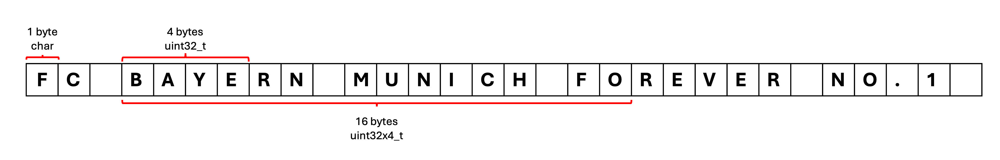
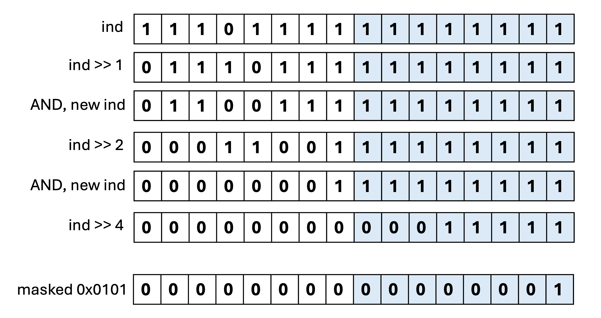

# String utilities with SIMD

[지난 SIMD 포스트](https://theintrance.github.io/blazing.cpp/blog/250705-simd-instruction) 에서는 SIMD Instruction 의 간단한 예제를 배웠습니다.

이번에는 [@ashvardanian] 의 [StringZilla](https://github.com/ashvardanian/StringZilla) 프로젝트에서 사용된 문자열 관련 함수들을 살펴보고 SIMD 가 어떻게 활용되었는지 알아보겠습니다.

## Find substring

어떤 문자열이 다른 문자열에 포함되어 있는지 확인하는 함수는 문자열 처리에서 가장 기본적인 함수 중 하나입니다.

스칼라 변수에 대한 처리는 간단하게 구현할 수 있습니다.

```cpp
bool contains(const char* haystack, std::size_t haystack_len, const char* needle, std::size_t needle_len) {
    for (size_t i = 0; i <= haystack_len - needle_len; i++) {
        bool match = true;
        for (size_t j = 0; j < needle_len; j++) {
            if (haystack[i + j] != needle[j]) {
                match = false;
                break;
            }
        }
        if (match) {
            return true;
        }
    }
    return false;
}
```

`contains` 함수는 나름 합리적인 구현체입니다.

하지만 SIMD 최적화의 여지가 있습니다.

[@ashvardanian] 는 `contains` 를 SIMD 로 구현하기 위해 한가지를 전제했는데요, 바로 `needle` 의 첫 4글자만 먼저 검색한 후 매치되는 부분이 없으면 더 이상 검색을 진행하지 않는 방식이 대부분의 경우 빠를 것이라는 겁니다.

SIMD 로 이 방식을 구현하면 아래와 같습니다.

```cpp
uint32_t prefix_val;
memcpy(&prefix_val, needle, 4);
uint32x4_t prefix = vdupq_n_u32(prefix_val);

uint32x4_t block0 = vld1q_u32(reinterpret_cast<const uint32_t*>(haystack + 0));
uint32x4_t block1 = vld1q_u32(reinterpret_cast<const uint32_t*>(haystack + 1));
uint32x4_t block2 = vld1q_u32(reinterpret_cast<const uint32_t*>(haystack + 2));
uint32x4_t block3 = vld1q_u32(reinterpret_cast<const uint32_t*>(haystack + 3));

uint32x4_t matches0 = vceqq_u32(block0, prefix);
uint32x4_t matches1 = vceqq_u32(block1, prefix);
uint32x4_t matches2 = vceqq_u32(block2, prefix);
uint32x4_t matches3 = vceqq_u32(block3, prefix);

uint32x4_t matches = vorrq_u32(vorrq_u32(matches0, matches1), vorrq_u32(matches2, matches3));
uint64x2_t reduced = vreinterpretq_u64_u32(matches);

bool has_match = vgetq_lane_u64(reduced, 0) | vgetq_lane_u64(reduced, 1);
```



`haystack` 이 "FC BAYERN MUNICH FOREVER NO. 1" 이고, 여기서 `needle` 인 "FOREVER" 이 substring 으로 존재하는지를 확인하려 합니다.

### 1. `needle` 의 첫 4글자를 `uint32_t` 로 복사

```cpp
uint32_t prefix_val;
memcpy(&prefix_val, needle, 4);
uint32x4_t prefix = vdupq_n_u32(prefix_val);
```

코드의 처음 부분에서 `needle` 의 첫 4글자를 `uint32_t` 로 복사합니다.

이제 `prefix_val` 은 `0x464f5245` 가 됩니다. (char 로 보면 `F` `O` `R` `E` 가 됩니다.)

이 값을 `vdupq_n_u32` 를 사용해 32비트 값 4개를 가진 총 128비트 벡터 레지스터로 확장합니다.

`prefix` 벡터 레지스터는 이제 `[ 0x464f5245, 0x464f5245, 0x464f5245, 0x464f5245 ]` 가 됩니다.

편의상 `["FORE", "FORE", "FORE", "FORE"]` 로 표현하겠습니다.

### 2. `haystack` 를 벡터 레지스터에 로드

```cpp
uint32x4_t block0 = vld1q_u32(reinterpret_cast<const uint32_t*>(haystack + i + 0));
uint32x4_t block1 = vld1q_u32(reinterpret_cast<const uint32_t*>(haystack + i + 1));
uint32x4_t block2 = vld1q_u32(reinterpret_cast<const uint32_t*>(haystack + i + 2));
uint32x4_t block3 = vld1q_u32(reinterpret_cast<const uint32_t*>(haystack + i + 3));
```

이제 `haystack` 의 첫 4글자를 벡터 레지스터에 로드합니다.

`vld1q_u32` 는 벡터 레지스터에 32비트 값 4개를 로드시키므로, `block0` 의 경우 `haystack` 의 첫 16글자를 4등분한 각 4글자를 벡터 레지스터에 로드합니다.

즉 `block0` 은 `["FC B", "AYER", "N MU", "NICH"]` 가 됩니다.

`block1` 부터는 haystack 의 1번째 인덱스부터 로드하므로 `["C BA", "YERN", " MUN", "NICH "]` 가 됩니다.

`block3` 까지 모두 로드하면 아래와 같은 벡터 레지스터가 생성됩니다.

```text
haystack: "FC BAYERN MUNICH FOREVER NO. 1"
block0: ["FC B", "AYER", "N MU", "NICH"]
block1: ["C BA", "YERN", " MUN", "ICH "]
block2: [" BAY", "ERN ", "MUNI", "CH F"]
block3: ["BAYE", "RN M", "UNIC", "H FO"]
```

### 3. `block0` 부터 `block3` 까지 `prefix` 와 비교

```cpp
uint32x4_t matches0 = vceqq_u32(block0, prefix);
uint32x4_t matches1 = vceqq_u32(block1, prefix);
uint32x4_t matches2 = vceqq_u32(block2, prefix);
uint32x4_t matches3 = vceqq_u32(block3, prefix);
```

`vceqq_u32` 는 벡터 레지스터의 각 요소를 비교하여 결과를 벡터 레지스터로 반환합니다.

```text
예시: vceqq_u32(
    [0x12345678, 0x56789abc, 0xcafebabe, 0xdeadbeef],
    [0x464f5245, 0x464f5245, 0xcafebabe, 0x464f5245]
)

결과: [0x00000000, 0x00000000, 0xFFFFFFFF, 0x00000000]

```

이제 `matches0` 부터 `matches3` 까지 모두 `prefix` 벡터와 비교하면 아래와 같은 결과가 나옵니다.

```text
block0:   ["FC B", "AYER", "N MU", "NICH"]
prefix:   ["FORE", "FORE", "FORE", "FORE"]
matches0: [0,       0,      0,     0]

block1:   ["C BA", "YERN", " MUN", "ICH "]
prefix:   ["FORE", "FORE", "FORE", "FORE"]
matches1: [0,       0,      0,     0]

block2:   [" BAY", "ERN ", "MUNI", "CH F"]
prefix:   ["FORE", "FORE", "FORE", "FORE"]
matches2: [0,       0,      0,     0]

block3:   ["BAYE", "RN M", "UNIC", "H FO"]
prefix:   ["FORE", "FORE", "FORE", "FORE"]
matches3: [0,       0,      0,     0]
```

### 4. `matches0` 부터 `matches3` 까지의 비교 결과 수합

```cpp
uint32x4_t matches = vorrq_u32(vorrq_u32(matches0, matches1), vorrq_u32(matches2, matches3));
uint64x2_t reduced = vreinterpretq_u64_u32(matches);
bool has_match = vgetq_lane_u64(reduced, 0) | vgetq_lane_u64(reduced, 1);
```

벡터 간 연산 결과는 항상 벡터이므로, `matchesN` 에서 바로 `matchesN != 0` 와 같이 스칼라 기반 비교는 할 수 없습니다.

따라서 `vreinterpretq_u64_u32` 를 사용해 32비트 값 4개를 가진 총 128비트 벡터 레지스터를 or 연산 하여 64비트 값 2개를 가진 총 128비트 벡터 레지스터로 변환합니다.

이제 `reduced` 벡터 레지스터는 `[0, 0]` 이 됩니다.

마지막으로 `vgetq_lane_u64` 를 사용해 64비트 값 2개를 가진 총 128비트 벡터 레지스터에서 64bit 씩 두개의 스칼라 값을 가져옵니다.

이제 `has_match` 는 `false` 가 됩니다.

### 5. 반복

첫번째 시도에서 `has_match` 가 `false` 이므로, haystack 의 4번째 인덱스부터 다시 같은 방식을 끝날 때 까지 반복합니다.

```cpp
haystack += 4
```

반복하는 과정에서 `has_match` 가 `true` 이면, 그 위치부터 스칼라 구현처럼 문자열을 비교하면 됩니다.

### 6. 벤치마크

```cpp
#include <arm_neon.h>
#include <cstring>
#include <cstdio>
#include <cstdint>
#include <benchmark/benchmark.h>

bool contains_scalar(
    const char* haystack,
    std::size_t haystack_len,
    const char* needle,
    std::size_t needle_len) {

    if (needle_len < 4 || haystack_len < 4) {
        return false;
    }

    for (std::size_t i = 0; i <= haystack_len - needle_len; i++) {
        bool match = true;
        for (std::size_t j = 0; j < needle_len; j++) {
            if (haystack[i + j] != needle[j]) {
                match = false;
                break;
            }
        }
        if (match) {
            return true;
        }
    }
    return false;
}

bool contains_simd(
    const char* haystack,
    std::size_t haystack_len,
    const char* needle,
    std::size_t needle_len) {

    if (needle_len < 4 || haystack_len < 4) {
        return contains_scalar(haystack, haystack_len, needle, needle_len);
    }

    uint32_t prefix_val;
    memcpy(&prefix_val, needle, 4);
    uint32x4_t prefix = vdupq_n_u32(prefix_val);

    for (std::size_t i = 0; i <= haystack_len - 4 - 3; i += 4) {
        uint32x4_t block0 = vld1q_u32(reinterpret_cast<const uint32_t*>(haystack + i + 0));
        uint32x4_t block1 = vld1q_u32(reinterpret_cast<const uint32_t*>(haystack + i + 1));
        uint32x4_t block2 = vld1q_u32(reinterpret_cast<const uint32_t*>(haystack + i + 2));
        uint32x4_t block3 = vld1q_u32(reinterpret_cast<const uint32_t*>(haystack + i + 3));

        uint32x4_t matches0 = vceqq_u32(block0, prefix);
        uint32x4_t matches1 = vceqq_u32(block1, prefix);
        uint32x4_t matches2 = vceqq_u32(block2, prefix);
        uint32x4_t matches3 = vceqq_u32(block3, prefix);

        uint32x4_t matches = vorrq_u32(vorrq_u32(matches0, matches1), vorrq_u32(matches2, matches3));
        uint64x2_t reduced = vreinterpretq_u64_u32(matches);

        if (vgetq_lane_u64(reduced, 0) || vgetq_lane_u64(reduced, 1)) {
            return contains_scalar(haystack + i, haystack_len - i, needle, needle_len);
        }
    }

    return false;
}

constexpr std::size_t TEXT_SIZE = 1000000;
constexpr const char SUBSTRING[] = "WXYZ";
constexpr std::size_t SUBSTRING_LEN = sizeof(SUBSTRING) - 1;

static void BM_ContainsScalar(benchmark::State& state) {
    std::string text(TEXT_SIZE, 'A');
    text.replace(TEXT_SIZE - SUBSTRING_LEN, SUBSTRING_LEN, SUBSTRING);
    for (auto _ : state) {
        benchmark::DoNotOptimize(contains_scalar(text.c_str(), TEXT_SIZE, SUBSTRING, SUBSTRING_LEN));
    }
}

static void BM_ContainsSimd(benchmark::State& state) {
    std::string text(TEXT_SIZE, 'A');
    text.replace(TEXT_SIZE - SUBSTRING_LEN, SUBSTRING_LEN, SUBSTRING);
    for (auto _ : state) {
        benchmark::DoNotOptimize(contains_simd(text.c_str(), TEXT_SIZE, SUBSTRING, SUBSTRING_LEN));
    }
}

BENCHMARK(BM_ContainsScalar);
BENCHMARK(BM_ContainsSimd);

BENCHMARK_MAIN();
```

아래는 벤치마크 결과입니다.

| Benchmark           | Time (ns) | CPU (ns) | Iterations |
|---------------------|-----------|----------|------------|
| BM_ContainsScalar   | 327339    | 326595   | 2124       |
| BM_ContainsSimd     | 243883    | 243700   | 2836       |

SIMD 구현이 스칼라 구현보다 빠른 것을 알 수 있습니다.

이처럼 SIMD 연산 뿐만 아니라 어떤 데이터 내에서 데이터를 찾아내는 것에 유용한 기능입니다.

응용하면 더 복잡한 문제에도 적용할 수 있습니다.

* `strlen` -> 0 으로 초기화된 벡터 레지스터를 슬라이딩 윈도우로 사용하여 옮겨가며 비교
* `tolower`, `toupper` -> 'A' ~ 'Z' 범위해 대해 벡터 기반 +32 적용 (소문자화)

<br>

# Pseudo-SIMD

SIMD 는 유용하지만, 최대 단점은 하드웨어에 종속되는 기능이라는 것입니다.

같은 기능을 여러 하드웨어에서 구동시키려면 여러 하드웨어가 제공하는 API 로 모두 구현해야 하니까요.

지금 소개할 Pseudo-SIMD 는 하드웨어에 종속되지 않는 기능으로, SIMD 는 아니지만 SIMD 를 흉내내는 기능입니다.

문자열에서 특정 문자 `n`의 위치를 찾아내는 코드를 살펴보겠습니다.

이번 `haystack` 은 "MANUEL NEUER" 이고, 여기서 `n` 은 'U' 라고 해보겠습니다.

```cpp
uint64_t nnnnnnnn = n;
nnnnnnnn |= nnnnnnnn << 8;  // broadcast `n` into `nnnnnnnn`
nnnnnnnn |= nnnnnnnn << 16; // broadcast `n` into `nnnnnnnn`
nnnnnnnn |= nnnnnnnn << 32; // broadcast `n` into `nnnnnnnn`
for (; haystack + 8 <= end; haystack += 8) {
    uint64_t haystack_part = *(uint64_t const *)haystack;
    uint64_t match_indicators = ~(haystack_part ^ nnnnnnnn);
    match_indicators &= match_indicators >> 1;
    match_indicators &= match_indicators >> 2;
    match_indicators &= match_indicators >> 4;
    match_indicators &= 0x0101010101010101;

    if (match_indicators != 0)
        return haystack - begin + ctz64(match_indicators) / 8;
}
```


### 1. `n` 을 broadcast

```cpp
uint64_t nnnnnnnn = n;
nnnnnnnn |= nnnnnnnn << 8;
nnnnnnnn |= nnnnnnnn << 16;
nnnnnnnn |= nnnnnnnn << 32;
```

`n`을 8비트씩 오른쪽으로 시프트하면서 비트를 채워넣습니다.

```cpp
n = 0x55 // ('U')
nnnnnnnn = n;
// nnnnnnnn = 0x55
nnnnnnnn |= nnnnnnnn << 8;
// nnnnnnnn = 0x5555
nnnnnnnn |= nnnnnnnn << 16;
// nnnnnnnn = 0x55555555
nnnnnnnn |= nnnnnnnn << 32;
// nnnnnnnn = 0x5555555555555555
```

### 2. `haystack` 에서 8바이트씩 추출

```cpp
uint64_t haystack_part = *(uint64_t const *)haystack;
```

`haystack` 에서 첫 8글자가 64비트 값으로 추출됩니다.

### 3. `haystack_part` 와 `nnnnnnnn` 의 XOR + NOT 을 통한 비교

```cpp
uint64_t match_indicators = ~(haystack_part ^ nnnnnnnn);
```

`haystack_part` 와 `nnnnnnnn` 의 XOR 연산 결과를 NOT 연산 하여 비교 결과를 얻습니다.

그럼 데이터는 아래와 같을겁니다

```
haystack_part:    4e204c45554e414d
nnnnnnnn:         5555555555555555
match_indicators: e48ae6efffe4ebe7
```

XOR 연산은 서로 같으면 0, 다르면 1 이 되기 때문에, XOR 이후 NOT 연산을 하면 동일한 부분의 바이트는 0xff 가 되는 것을 알 수 있습니다.

### 4. `match_indicators` 에서 결과 추출

```cpp
match_indicators &= match_indicators >> 1;
match_indicators &= match_indicators >> 2;
match_indicators &= match_indicators >> 4;
match_indicators &= 0x0101010101010101;

if (match_indicators != 0)
    return haystack - begin + ctz64(match_indicators) / 8;
```

이제 비교 결과를 알 수 있도록 쉬프트와 AND 연산을 사용하는데요, 쉽게 설명하기 위해 2바이트만 예시로 살펴보겠습니다.



`>> 1`, AND, `>> 2`, AND, `>> 4` 를 통해 각 바이트에 0이 포함되어있으면 해당 0이 인접 비트까지 0으로 만들어버려 결과적으로 0이 하나라도 포함된 바이트는 0이 되고, 오직 0xFF 만 최하위 비트가 1 이 되는 것을 알 수 있습니다.

이후 `match_indicators` 가 0이 아니라면 `haystack_part` 에 `n` 이 포함되어있다는 뜻이고, `ctz64` 를 통해 1 이 몇번째 비트에 있는지 알 수 있습니다.

이 값을 8로 나누면 문자열 속 `n` 의 위치를 알 수 있습니다.

`ctz64` 는 표준은 아니지만, `__builtin_ctzll` 처럼 컴파일러 내장 함수로 제공되기도 합니다.

C++20 부터는 표준으로 지원하기도 합니다. [std::countr_zero](https://en.cppreference.com/w/cpp/numeric/countr_zero) 를 참고하세요.

# 마치며

이번 포스트에서는 SIMD 를 이용한 문자열 검색 방법과, 하드웨어에 종속되지 않는 Pseudo-SIMD 를 살펴보았습니다.

SIMD 를 활용하는 방식은 연산에 한정되어있지 않고, 데이터를 찾아내는 것에도 유용하다는 것을 알 수 있었습니다.

Pseudo-SIMD 는 하드웨어에 종속되어 있지 않으니 도입이 쉬워 많은 곳에서 활용할 수 있겠습니다.


[@ashvardanian]: https://ashvardanian.com